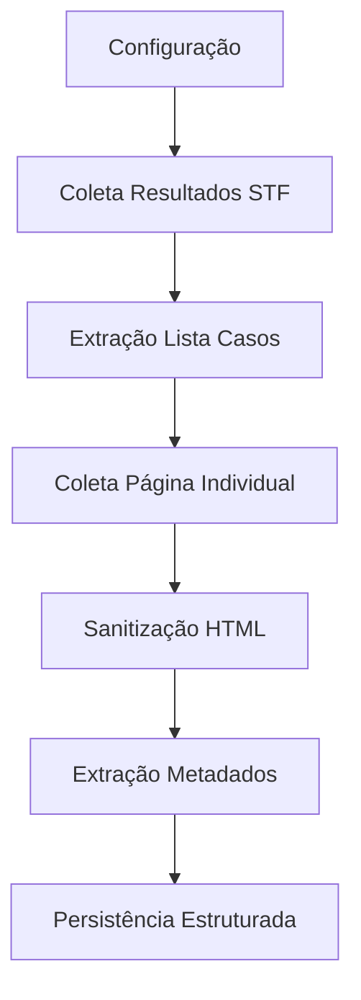

# Documento de Conhecimento: Projeto CITO
## Visão do Projeto para Configuração de IA

## 1. IDENTIFICAÇÃO DO PROJETO
- **Nome:** Projeto CITO (Coleta Inteligente de Teorias e Observações)
- **Domínio:** Jurisprudência Brasileira / Direito
- **Tribunal Foco:** Supremo Tribunal Federal (STF)
- **Tipo:** Plataforma de Processamento e Análise de Dados Jurídicos
- **Status Desenvolvimento:** Pipeline ETL em Operação

## 2. VISÃO GERAL E PROPÓSITO
### 2.1. Declaração de Visão
Transformar decisões judiciais não estruturadas do STF em **dados confiáveis, pesquisáveis e analíticos** através de automação completa do ciclo de processamento.

### 2.2. Propósito Principal
Criar uma **fonte única de verdade estruturada** para jurisprudência do STF, habilitando:
- Buscas avançadas semânticas
- Análises históricas e estatísticas
- Geração de indicadores estratégicos
- Rastreabilidade documental completa

### 2.3. Documentos de Referência
- Documento de Visão do Projeto
- Documento de Discovery
- Especificações Técnicas do Pipeline

## 3. PROBLEMAS RESOLVIDOS
### 3.1. Desafios do Ambiente Jurídico Atual
| Problema | Impacto | Solução CITO |
|----------|---------|--------------|
| Alto volume e dispersão de publicações | Dificuldade de acompanhamento | Monitoramento contínuo automatizado |
| Falta de padronização de metadados | Inconsistência na análise | Estruturação e normalização automática |
| Dificuldade acesso ao inteiro teor | Limitação na pesquisa | Preservação completa com rastreabilidade |
| Complexidade em citações doutrinárias | Análise manual inviável | Pipeline preparado para NLP futuro |
| Ausência de dashboards consolidados | Decisões sem base analítica | Base para relatórios e visualizações |

### 3.2. Gap de Mercado
Não existe solução integrada que combine:
- Coleta automática em tempo real
- Estruturação profunda de metadados
- Preservação do documento original
- Capacidade analítica avançada

## 4. OBJETIVOS DO SISTEMA
### 4.1. Objetivos Primários (MVP)
- [x] Monitoramento automático contínuo
- [x] Preservação de documentos originais (HTML/PDF)
- [x] Estruturação de metadados jurídicos essenciais
- [x] Base integrada de decisões e metadados
- [x] Busca avançada básica
- [x] Dashboard mínimo de indicadores

### 4.2. Objetivos Secundários (Roadmap)
- [ ] Análise de citações doutrinárias
- [ ] NLP para extração de conceitos jurídicos
- [ ] Integração com outros tribunais
- [ ] APIs para sistemas externos
- [ ] Alertas inteligentes por tópico

## 5. ARQUITETURA DO PIPELINE
### 5.1. Princípios Arquiteturais
- **ETL Orientado a Documentos**: Cada decisão é um documento com estados
- **Idempotência**: Reprocessamento seguro sem side-effects
- **Rastreabilidade**: Audit trail completo de todas as transformações
- **Resiliência**: Tolerância a falhas com retry mechanisms

### 5.2. Fluxo de Processamento


## 6. COMPONENTES DO SISTEMA
### 6.1. Módulos Principais
| Módulo | Responsabilidade | Tecnologia | Estado |
|--------|-----------------|------------|---------|
| `a_load_configs.py` | Gestão dinâmica de configurações | Google Sheets API | ✅ |
| `b_search_save_html.py` | Coleta páginas de resultado | Playwright + MongoDB | ✅ |
| `c_extract_data.py` | Extração lista de casos | BeautifulSoup | ✅ |
| `e_fetch_case_html.py` | Coleta página individual do caso | Playwright/Requests | ✅ |
| `f_sanitize_case_html.py` | Limpeza do HTML relevante | lxml/XPath | ✅ |
| `g_process_case_html_sanitized.py` | Extração metadados detalhados | Parsers customizados | ✅ |

### 6.2. Padrão de Controle de Concorrência
```
Estado Inicial → Claim Atômico → Estado Processamento → Resultado
    ↓
Erro registrado com motivo
    ↓
Possibilidade de reprocessamento
```

## 7. MODELO DE DADOS
### 7.1. Coleções MongoDB
```javascript
// Estrutura Conceitual
{
  raw_html: "HTML bruto da busca",
  case_data: "Documento central do sistema",
  caseHtml: "HTML completo coletado",
  caseHtmlSanitized: "HTML limpo e relevante"
}
```

### 7.2. Entidades do Domínio
1. **Decisão**: Documento judicial completo
2. **Processo**: Número identificador único
3. **Classe**: Tipo processual (ADPF, ADI, RE, etc.)
4. **Relator**: Ministro responsável
5. **Órgão Julgador**: Turma ou Plenário
6. **Citação**: Referência a doutrina (futuro)
7. **Obra**: Livro ou artigo citado (futuro)
8. **Autor**: Acadêmico ou jurista (futuro)

### 7.3. Campos Extraídos (Exemplo)
```python
campos_extraidos = {
    "numero_processo": "string normalizada",
    "classe_processual": "código e descrição",
    "relator": "nome e código",
    "orgao_julgador": "turma/plenário",
    "datas": ["publicacao", "julgamento", "registro"],
    "secoes_textuais": {
        "ementa": "texto",
        "partes": "texto estruturado",
        "publicacoes": "lista de eventos"
    }
}
```

## 8. CONTROLE DE ESTADO
### 8.1. Transições Atômicas
Cada documento segue uma máquina de estados explícita:
```
new → extracting → extracted → caseScraping → caseScraped 
→ caseSanitizing → caseSanitized → caseProcessing → caseHtmlProcessed
```

### 8.2. Garantias Operacionais
- **Atomicidade**: Transições via operação única MongoDB
- **Consistência**: Um worker por documento simultaneamente
- **Durabilidade**: Persistência imediata após cada etapa
- **Rastreabilidade**: Timestamp e worker ID em cada transição

## 9. ESCOPO DO MVP
### 9.1. Funcionalidades Implementadas
- [x] Coleta retroativa (6 meses)
- [x] Extração metadados essenciais
- [x] Consulta por processo e relator
- [x] Dashboard básico
  - Volume por classe processual
  - Ranking de relatores
- [x] Base preparada para NLP futuro

### 9.2. Limitações Atuais (MVP)
- Citações doutrinárias não processadas
- Análise semântica básica
- Um tribunal apenas (STF)
- Dashboard com visualizações mínimas

## 10. ROADMAP EVOLUTIVO
### Fase 1: Consolidação (Atual)
- Estabilização do pipeline
- Expansão do período histórico
- Dashboard básico operacional

### Fase 2: NLP e Análise Avançada
- Identificação automática de citações
- Normalização de entidades jurídicas
- Similaridade entre decisões
- Clusterização por tópicos

### Fase 3: Expansão Multi-Tribunal
- Inclusão do STJ
- Inclusão de TRFs e TJs
- Modelos específicos por instância

### Fase 4: Inteligência Aplicada
- Previsão de temas recorrentes
- Alertas por mudança jurisprudencial
- Análise de voto por ministro
- Integração com sistemas jurídicos

## 11. CONTEXTOS PARA IA/ML
### 11.1. Oportunidades de Automação
1. **Classificação Automática**: Atribuir tags/tópicos às decisões
2. **Extração de Relacionamentos**: Citações entre decisões
3. **Sumarização**: Ementas automáticas mais completas
4. **Similaridade Semântica**: Encontrar decisões correlatas
5. **Análise Temporal**: Evolução de posicionamentos

### 11.2. Dados Disponíveis para Treinamento
- Textos completos das decisões
- Metadados estruturados
- Relacionamentos processo-classe-relator
- Histórico temporal completo
- Seções textuais separadas (ementa, partes, etc.)

### 11.3. Desafios Técnicos para IA
- Linguagem jurídica formal e complexa
- Referências cruzadas extensas
- Variações de formato ao longo do tempo
- Necessidade de interpretação contextual
- Requisitos de precisão extremamente altos

## 12. GLOSSÁRIO
| Termo | Definição |
|-------|-----------|
| **Jurisprudência** | Conjunto de decisões judiciais sobre matéria similar |
| **Ementa** | Resumo oficial da decisão |
| **Classe Processual** | Tipo de ação judicial (ADI, ADPF, RE, etc.) |
| **Relator** | Ministro responsável pelo processo |
| **Órgão Julgador** | Turma (5 ministros) ou Plenário (11 ministros) |
| **Pipeline ETL** | Extract, Transform, Load - processo de processamento de dados |

## 13. CONSIDERAÇÕES PARA INTEGRAÇÃO COM IA
### 13.1. Pontos de Extensão Naturais
1. **Hook pós-processamento**: Injetar análise de NLP após `caseHtmlProcessed`
2. **Enriquecimento incremental**: Adicionar campos calculados por IA
3. **Serviços auxiliares**: Microserviços para análise específica
4. **Treinamento contínuo**: Feedback loop com especialistas jurídicos

### 13.2. Requisitos para Modelos de IA
- **Explicabilidade**: Capacidade de justificar previsões
- **Auditabilidade**: Rastreio completo de inputs/outputs
- **Atualização**: Adaptação a mudanças na jurisprudência
- **Precisão**: Taxa de erro mínima para uso jurídico

---

**Última Atualização**: Pipeline operacional com dados históricos  
**Próxima Fase**: Implementação de módulos de NLP para citações  
**Responsável Técnico**: Equipe de Engenharia de Dados CITO  
**Contato**: [dados@cito.com.br](mailto:dados@cito.com.br)
